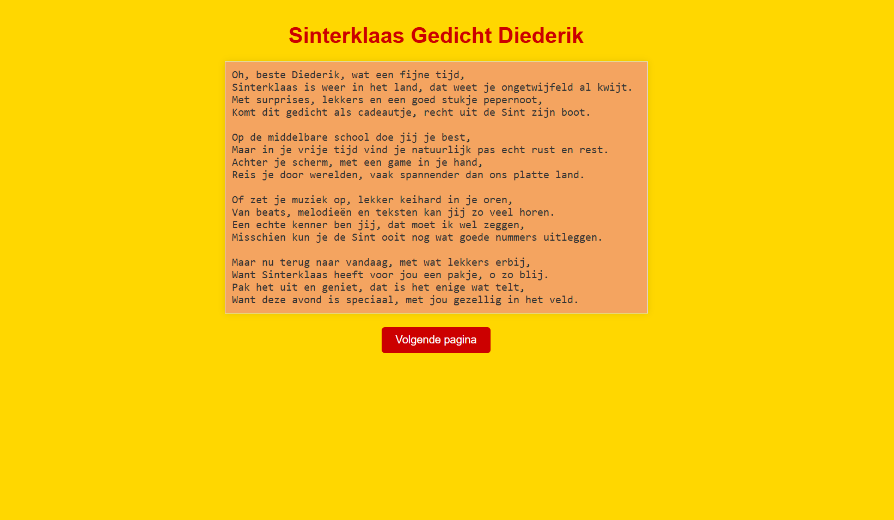

# GPT-Powered Oneindig Gedicht

Dit is een kleine flask app die een (sinterklaas)gedicht presenteerd in je browser (http://localhost:8000/). Tijdens het lezen van het gedicht schrijft GPT-4o op de achtergrond het volgende kantje van het gedicht op basis van het huidige kantje. Kijk hoelang iemand blijft lezen tot ze realiseren dat er nooit een einde aan komt! 

Om dit script te gebruiken heb je een GPT API key nodig en wat tegoed op je openai account.

